<div align="center">

<!-- Animated Banner -->


<br/>

<!-- Primary Links -->
[](https://bisu.com.np)
[](https://github.com/bisug)

<br/>

<!-- Stats Badges -->
[](https://github.com/bisug?tab=followers)
[](https://github.com/bisug?tab=repositories)
[](https://github.com/bisug)

</div>

---

## About Me

> ✦ $\color{cyan}{\text{Hi! I'm Bisu.}}$ I am a student aiming for a career in $\color{purple}{\text{Cybersecurity.}}$

```diff
- bisu@cyber-sec-node:~$ whoami
+ Name       : Bisu Ghalan
+ Username   : bisug
+ Aim       : Cybersecurity Professional
+ Location   : Nepal
+ Portfolio  : https://bisu.com.np

- bisu@cyber-sec-node:~$ cat education.json
+ {
+   "degree"   : "BCs. (Hons) Cyber Security & Networking Technology",
+   "college"  : "Lincoln International College, Nepal",
+   "semester" : "Semester-2"
+ }

- bisu@cyber-sec-node:~$ nmap -sV current_targets.local
+ Starting Nmap ( https://nmap.org )
+ PORT    STATE SERVICE       REASON
+ 22/tcp  open  development   Python, C++, Go
+ 80/tcp  open  networking    Network Fundamentals, Packet Analysis
+ 443/tcp open  cybersec      Ethical Hacking, Cyber Ethics
```

---

## Currently Working On

- > Learning Python, C++, Go & other languages as per course requirements
- > Exploring networking technology fundamentals & packet analysis

---


## Tech Stack

**Languages**


**Databases & Storage**


> *Redis (Concepts) & PostgreSQL (Basics)*

**Containerization**


**Tools & Environment**


---

<div align="center">

## GitHub Statistics

|  |  |
| :--- | :--- |

<br/>


<br/>


</div>

<div align="center">

## GitHub Trophies


</div>

---

<div align="center">

## Cybersecurity Path


</div>

<br/>

<div align="center">

```diff
root@cyber-sec-node:~/learning# cat current_focus.txt

+ [>] CORE CONCEPTS
    - Networking Fundamentals (OSI, TCP/IP, Routing)
    - Core Programming & Logic Concepts

+ [>] PRACTICAL LABS & TOOLS
    - Cisco Packet Tracer (Network Simulation)
    - Wireshark (Packet Analysis & Sniffing)
    - HackTheBox (CTFs & Practical Application)

+ [>] SELF-STUDY & RESEARCH
    - Exploring basic scripting tutorials online
    - Gathering knowledge & building foundations
```

<br/>

> **Note:** Check out my **pinned repositories** below to see what I've built.

<!-- Cybernetic Activity Tracker -->


<picture>
  <source media="(prefers-color-scheme: dark)" srcset="https://raw.githubusercontent.com/bisug/bisug/output/snake-dark.svg" />
  <source media="(prefers-color-scheme: light)" srcset="https://raw.githubusercontent.com/bisug/bisug/output/snake.svg" />
  
</picture>


</div>

---

<div align="center">

## ▸ Get In Touch

[](https://bisu.com.np)
[](https://linkedin.com/in/bisu-ghalan)
[](https://instagram.com/oyeee.bisu)
[](mailto:bisu.ghalan@gmail.com)

<br/>

*Always open to discussing networking concepts, teaming up for HTB/CTFs, and contributing to open-source or Telegram-related projects!*

</div>


